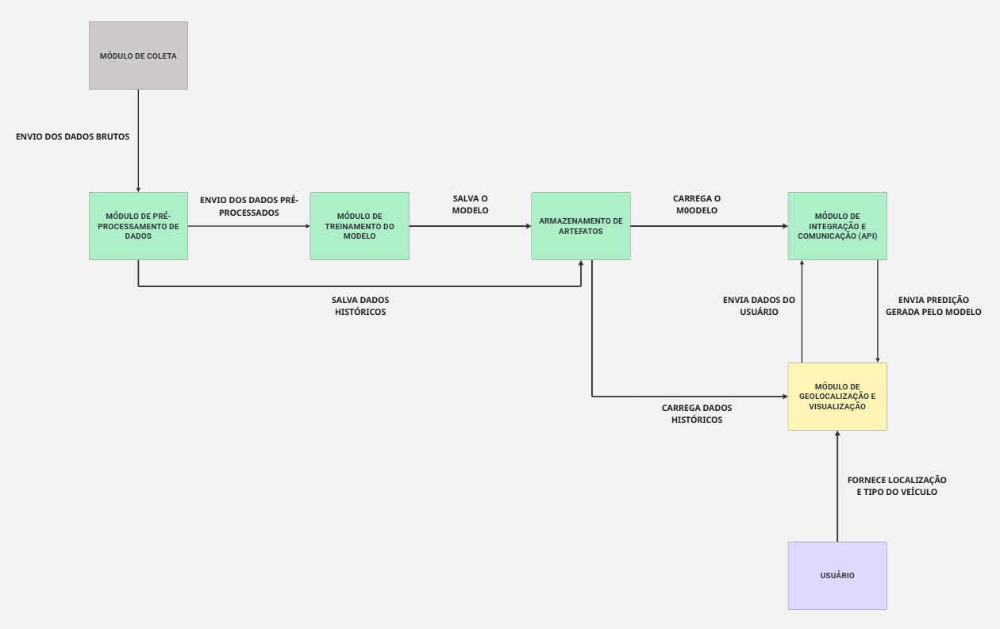

# **🛡️ SHIELD - Sistema de Análise e Previsão de Risco Viário (Bauru-SP)**

O **SHIELD** é uma plataforma full-stack de desenvolvida para analisar, monitorar e prever riscos de acidentes de trânsito na cidade de Bauru-SP. O sistema integra dados históricos de sinistros (2022-2025) com condições meteorológicas (precipitação) para treinar modelos de Machine Learning capazes de identificar zonas de calor e prever a probabilidade de acidentes em tempo real.

## **Índice**

* [Visão Geral e Objetivos](#visão-geral-e-objetivos)  
* [Funcionalidades do Sistema](#funcionalidades-do-sistema)  
* [Arquitetura da Solução](#arquitetura-da-solução)  
* [Tecnologias e Ferramentas](#tecnologias-e-ferramentas)  
* [Estrutura de Diretórios](#estrutura-de-diretórios)  
* [Pipeline de Ciência de Dados](#pipeline-de-ciência-de-dados)  
* [Documentação da API](#documentação-da-api)  
* [Guia de Instalação](#guia-de-instalação)  
* [Resultados e Métricas](#resultados-e-métricas)

## **Visão Geral e Objetivos**

O trânsito urbano é um sistema complexo influenciado por fatores estáticos (geometria da via) e dinâmicos (clima, fluxo). O projeto SHIELD visa auxiliar gestores públicos e cidadãos através de:

1. **Integração de Dados Heterogéneos:** dados pluviométricos e malha viária.  
2. **Análise Preditiva:** Estimar o risco de sinistros em um determinado local sob condições específicas (ex: chuva intensa).  
3. **Visualização Geoespacial:** Mapeamento interativo de zonas de risco.

## **Funcionalidades do Sistema**

### **Frontend (Dashboard Web)**

* **Mapa Interativo (Leaflet):** Visualização de marcadores de acidentes e mapas de calor (Heatmaps) sobre a malha de Bauru.  
* **Painel de Estatísticas:** Gráficos dinâmicos (Barra/Linha) mostrando a evolução temporal dos acidentes e tipos de veículos envolvidos.  
* **Sistema de Alertas:** Notificações visuais baseadas nas previsões do modelo para as condições atuais.  
* **Filtros de Visualização:** Seleção por ano, tipo de acidente ou condição climática.

### **Backend (API & ML)**

* **API RESTful:** Endpoints para comunicação entre o modelo de ML e o frontend.  
* **Classificação de Risco:** Algoritmo capaz de classificar um segmento viário como "Alto Risco" ou "Baixo Risco".  
* **Processamento de Dados:** Scripts automáticos para limpeza e transformação de dados brutos (ETL).

## **Arquitetura da Solução**

O sistema segue uma arquitetura cliente-servidor desacoplada, onde o frontend consome serviços de dados e predição providos pelo backend Python.




## **Tecnologias e Ferramentas**

### **Ciência de Dados e Backend**

* **Linguagem:** Python 3.12+  
* **Manipulação de Dados:** Pandas, NumPy, GeoPandas  
* **Machine Learning:** Scikit-learn (Random Forest, SVM, MLP), XGBoost  
* **Visualização de Dados:** Matplotlib, Seaborn  
* **Servidor Web:** Framework Python nativo ou Flask (implícito em server.py)  
* **Persistência de Modelo:** Pickle (.pkl)

### **Frontend**

* **Framework:** Vue.js 3 (Composition API)  
* **Mapas:** Leaflet.js / Vue2Leaflet  
* **Estilização:** CSS3 Scoped, Design Responsivo  
* **Build Tool:** Vue CLI / Webpack

## **Estrutura de Diretórios**

Descrição detalhada dos principais módulos do projeto:

SHIELD/  
├── data/                            # Repositório de dados (Lake)  
│   ├── Acidentes/                   # Dados brutos de sinistros e veículos  
│   └── Chuva/                       # Séries temporais de precipitação (2022-2025)  
├── frontend/                        # Aplicação Web (Vue.js)  
│   ├── public/                      # Assets estáticos (JSONs geoespaciais)  
│   └── src/  
│       ├── components/              # Componentes Vue (Mapa, Gráficos, Alertas)  
│       ├── assets/                  # Estilos CSS e Imagens  
│       └── services/                # (Opcional) Comunicação com API  
├── src/                             # Núcleo do processamento Backend  
│   ├── backend/                     # Servidor da API  
│   │   ├── server.py                # Servidor genérico  
│   │   └── server\_random\_forest.py  # Servidor dedicado ao modelo final  
│   ├── model/                       # Modelos treinados serializados (.pkl)  
│   └── pre\_processamento/           # Scripts ETL (Limpeza e Padronização)  
├── notebooks/                       # Laboratório de Ciência de Dados  
│   ├── amostragem\_negativa.ipynb    # Geração de exemplos de não-acidentes  
│   ├── analise\_pr\_auc.ipynb         # Avaliação de métricas de performance  
│   ├── xgboost.ipynb                # Treinamento e tunagem do XGBoost  
│   └── random\_forest.ipynb          # Treinamento e tunagem do Random Forest  
└── requirements.txt                 # Dependências do projeto Python

## **Pipeline de Ciência de Dados**

O sucesso do modelo depende de um tratamento rigoroso dos dados, dada a natureza desbalanceada de acidentes de trânsito (muitos momentos "sem acidente" vs poucos "com acidente").

1. **ETL (Extração, Transformação e Carga):**  
   * Scripts em src/pre_processamento unificam bases de dados dispersas e corrigem inconsistências geográficas.  
2. **Amostragem Negativa (Negative Sampling):**  
   * Para que o modelo aprenda o que é "segurança", foi gerado exemplos sintéticos ou amostramos momentos reais onde **não** ocorreram acidentes.  
   * O projeto testou diversas proporções de balanceamento (arquivos dataset_final_para_modelo_1_4.csv, 1_20.csv, 1_50.csv) para encontrar o ponto ótimo entre precisão e recall.  
3. **Seleção de Modelos:**  
   * Foram avaliados: **Random Forest**, **XGBoost** e **MLP (Redes Neurais)**.  
   * O **Random Forest** apresentou a melhor consistência e robustez, sendo escolhido como modelo final (modelo_risco_viario_final.pkl).

## **Documentação da API**

O backend expõe endpoints para fornecer predições ao frontend.

### **1. Verificar Status da API**

* **Endpoint:** GET /  
* **Retorno:** Confirmação de que o servidor está online.

### **2. Prever Risco Viário**

* **Endpoint:** POST /predict (Exemplo hipotético baseado na lógica do projeto)  
* **Body (JSON):**  
  {  
    "latitude": -22.3145,  
    "longitude": -49.0587,  
    "precipitacao": 10.5,  
    "hora": 18,  
    "dia_semana": 4  
  }

* **Resposta:**  
  {  
    "risco": "Alto",  
    "probabilidade": 0.85  
  }

## **Guia de Instalação**

### **Pré-requisitos**

* **Python 3.10+**  
* **Node.js 16+ & NPM**

### **Passo 1: Configurar Backend**

1. Clone o repositório:  
   git clone [https://github.com/pedrosmithhh/shield.git](https://github.com/pedrosmithhh/shield.git)  
   cd shield

2. Crie e ative o ambiente virtual:

```bash
   python -m venv venv
```

3. Instale as bibliotecas:

```bash
   pip install \-r requirements.txt
```

4. Inicie o servidor de predição: 

```bash
   python src/backend/server_random_forest.py
```

### **Passo 2: Configurar Frontend**

1. Em um novo terminal, entre na pasta do frontend:

```bash
   cd frontend
```

2. Instale as dependências:

```bash
   npm install
```

3. Execute o projeto em modo de desenvolvimento:

```bash
   npm run serve
```

4. Acesse http://localhost:8080 no seu navegador.

## **Resultados e Métricas**

A validação dos modelos utilizou métricas adequadas para classes desbalanceadas, focando na **Curva Precision-Recall (PR-AUC)** em vez de apenas acurácia (que pode ser enganosa neste contexto).

* **Modelo Campeão:** Random Forest.
